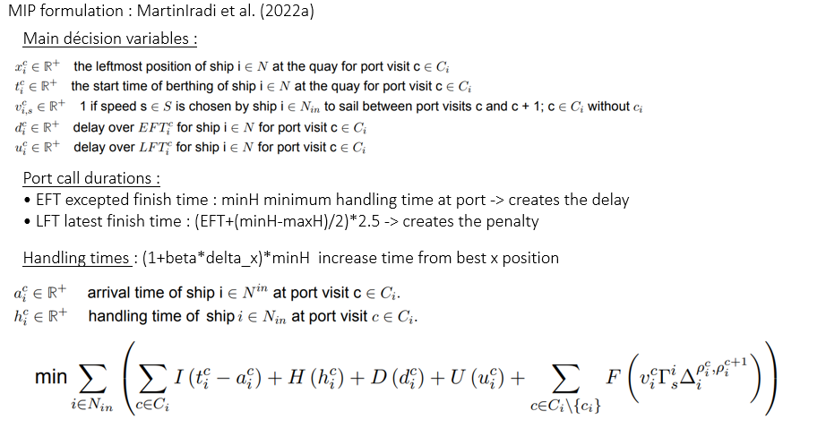
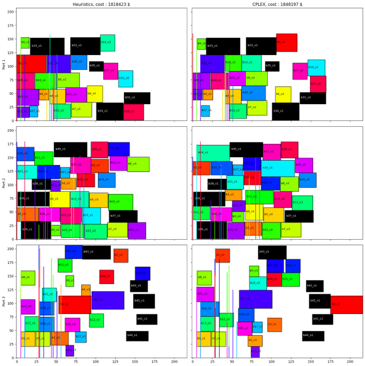
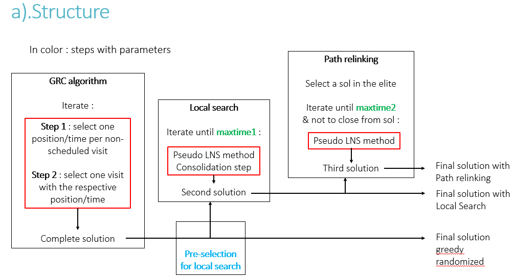
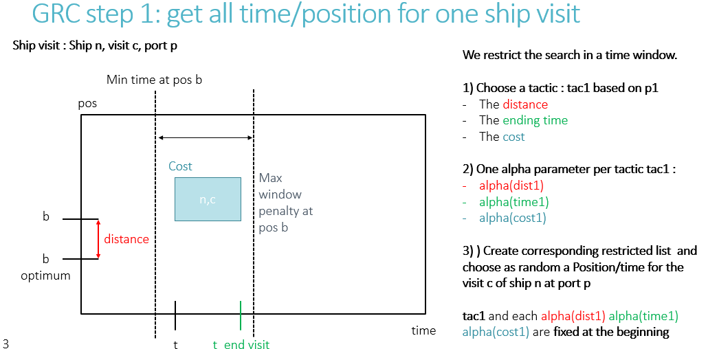
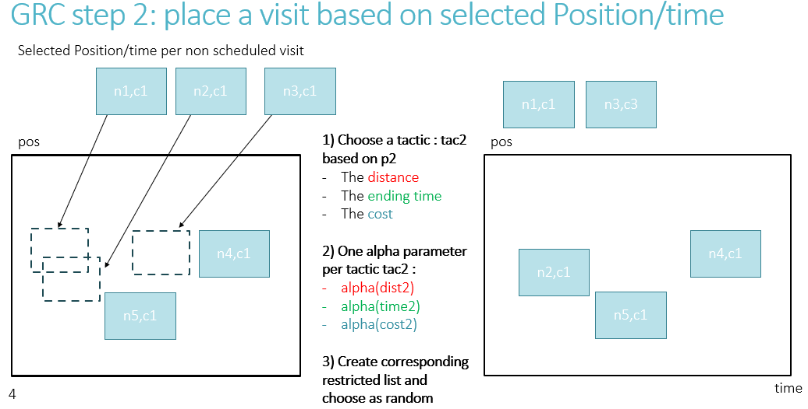
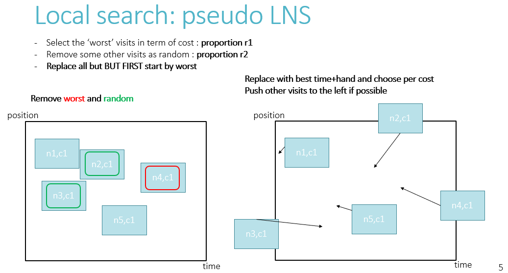
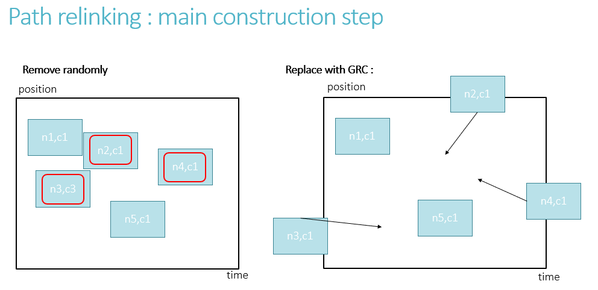

# Multi-port berth allocation problem on Julia : meta-heuristic approach

J'ai ici l'entièreté du code que j'ai utilisé pour ma master thesis. Il y a beaucoup de fonctions différentes et de code. Je résume ici les étapes avec quelques explications qui sont des screenshots de ma présentation pour cette thèse.

## Définition succinte du problème

Le problème est le suivant : nous devons, à partir d'un emploi du temps approximatif préalablement établi, définir les temps d'arriver, positions et vitesses des bateaux. Cet emploi du temps initial définit des temps d'arrivée pour chaque bateaux et une position optimum pour chaque bateau à chaque port. Un bateau peut donc avoir plusieurs visites qu'il va devoir effectuer dans un ordre donné. Le but est de minimiser le coût total pour cette flotte. La congestion des ports va pouvoir créer des délais ou encore obliger les bateaux à amarrer à des positions non-optimums.

Ici :

- **I** : le coût dû au temps d'attente à un port
- **H** : le handling time
- **D** : le délai créé
- **U** : la pénalité dû à un délai trop important
- **F** : le coût de carburant

## Solution dans un espace 2D pour chaque port 

Ici une solution construite à partir du CPLEX et de mon heuristique. Chaque couleur correspond à un bateau et chaque graph par colonne un port donné (du plus au moins congestionné) dans l'espace position/temps.  Un carré correspond donc en ordonnée à la place prise sur le quai et en abscisse le temps passé à cette position. Cette visualisation est importante pour comprendre les contraintes de ce problème ainsi que la façon de définir une solution à partir des coordonnées de chaque visite dans ces espaces.

## Structure principale :

### Sur le papier :

Il y a trois étapes principales :

- greedy randomized algorithm : il y a deux étapes principales. Pour chaque visite (c'est à dire la visite d'un bateau à un port donné dans une fenêtre de temps fixe) on choisit un temps et une position d'arrivée (en vérifiant la faisabilité). Parmi toutes ces visites on en choisit une et la fixe.

- Local search : j'ai implémenté une pseudo LNS méthode en détruisant puis reconstruisant une partie de la solution. Il est important de noter que les visites déplacées se trouvent 'à coté', autour d'une même visite. La reconstruction se fait de manière particulière en choisissant les meilleurs positions/temps par coût et en essayant de rapprocher au maximum les visites.

- Path Relinking : pour le path relinking la méthode employée est similaire à la local search. Néanmoins ici la reconstruction se fait en utilisant le GRASP algorithm (ainsi que ses paramètres).

### La structure du code :

Ici une petite explication des différents scripts :

- **MBAP_INST.jl** : définition et structure des instances

- **Heur/check_solution.jl** :  fonctions pour vérifier le coût et la faisabilité des solutions
- **Heur/get_iterations.jl** :  fonctions pour extraire les informations des solutions pour analyse
- **Heur/MBAP_SOL.jl** :  définitions et structures des instances solutions et visites
- **Heur/toolsMatrixTimes.jl** :  tool box pour update les matrixes 2D représentant les ports
- **Heur/utilInit** :  structures et fonctions qui permettent de définir l'ensemble des paramètres et les modifier

- **Heur/GRASPlocalpathfinal/greedyrandomized.jl** : fonctions qui implémentent la greedy randomized construction (avec les deux étapes principales)
- **Heur/GRASPlocalpathfinal/localsearch.jl** : fonctions qui implémentent la local search ainsi que la pushing method
- **Heur/GRASPlocalpathfinal/Pathrelinkingstep.jl** : spécifique greedy randomized construction pour le path relinking
- **Heur/GRASPlocalpathfinal/allsteps.jl** : implémentation de toutes les étapes ensembles

## GRASP algorithm

Ici sont représentés schématiquement les deux étapes de l'algorithme avec pour exemple des visites se situant dans un même port. Comme vous pouvez le constater il y a beaucoup de paramètres différents. Pour chacun des étapes une tactique doit être choisie :

- distance : la distance entre la position choisie et la position optimum du bateau.
- time : le temps d'arrivée du bateau au port
- cost : le coût total d'ajout de cette visite à la solution

Pour la première étape on calcul ces différentes métriques et choisit plusieurs position/temps pour chaque visite en utilisant des restricted lists et alpha parameters. On fixe ensuite la position/temps pour chaque visite en utilisant ces listes. Pour la deuxième étape on réutilise ces positions/temps en comparant les visites entre elles. J'ai créé de même des restricted listes et choisie la visite à placer.

## Local Search

- Ici la première étape et de retirer un cluster de visites qui sont proches les unes des autres dans le 2D space. Une visite est choisie aléatoirement et un cluster de visites l'entourant est ensuite retiré. Ensuite ces visites sont placés de sorte à minimiser le coût.

- Ensuite on regarde à l'ensemble de la solution et en fonction de l'ordre actuel des visites dans l'espace 2D de chaque port on les replace en essayant de minimiser l'ensemble des délais en 'poussant' les visites.

## Path Relinking

Enfin pour le pathrelinking il y a de même une étape de destruction mais cette fois seulement les visites sont retirées aléatoirement (sans clusters). Ensuite la même greedy randomized construction est utilisée pour reconstruire la solution.

## CPLEX

- **CPLEX/MIP_big.jl** : code pour l'application du CPLEX de IBM au problème.

Dans ce code vous pouvez retrouver les contraintes et variables du problème décrites pour l'application du CPLEX. Il y a aussi quelques fonctions pour formater et sauvegarder les solutions.