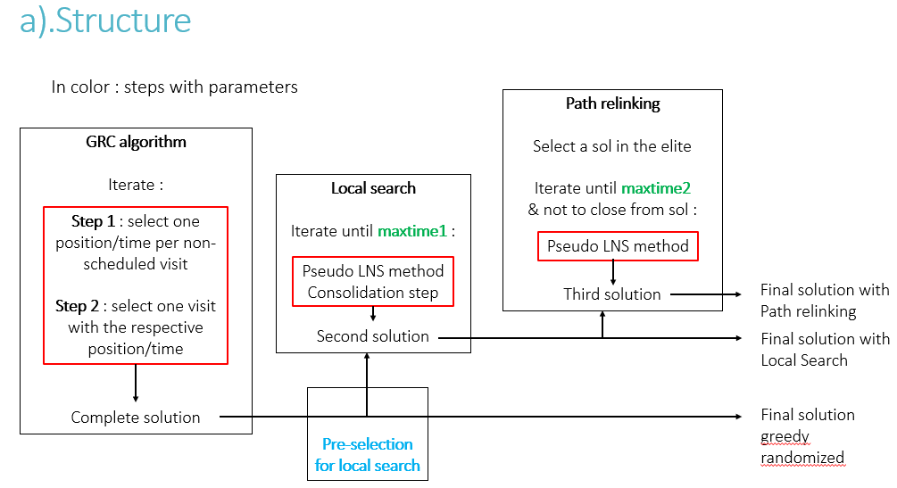
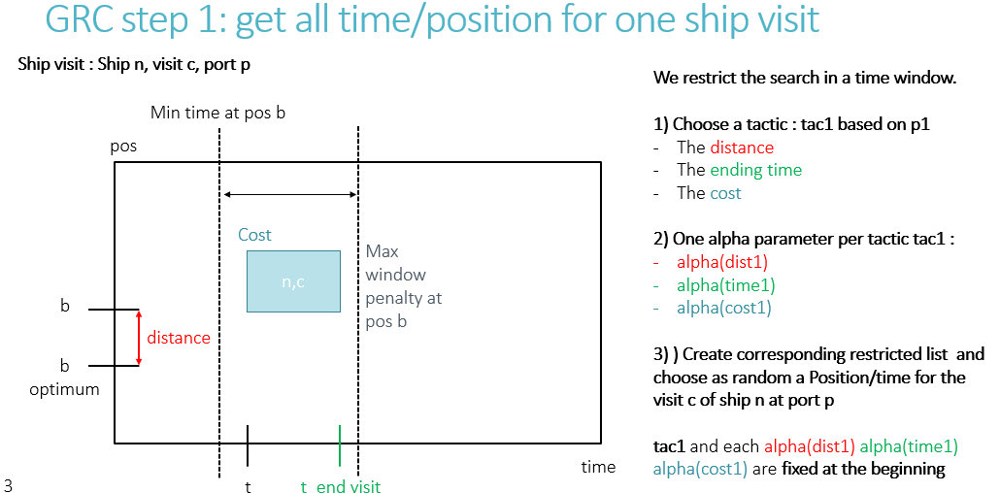

# Multi-port berth allocation problem on Julia : meta-heuristic approach

J'ai ici l'entièreté du code que j'ai utilisé pour ma master thesis. Il y a beaucoup de fonctions différentes et d'étapes je mets donc ici quelques explications qui sont des screenshots de ma présentation pour cette thèse.

## Définition succinte du problème

## Structure principale :

### Sur le papier :

Il y a trois étapes principales :

- greedy randomized algorithm : il y a deux étapes principales. Pour chaque visite (c'est à dire la visite d'un bateau à un port donné dans une fenêtre de temps fixe) on choisit un temps et une position d'arrivée (en vérifiant la faisabilité). Parmis toutes ces visites on en choisit une et la fixe.

- Local search : j'ai implémenté une pseudo LNS méthode en détruisant puis reconstruisant une partie de la solution. Il est important de noter que les visites déplacées se trouvent 'à coté', autour d'une même visite. La reconstruction se fait d' manière particulière en choisissant les meilleurs positions/temps par coût et en essayant de rapprocher au maximum les visites.

- Path Relinking : pour le path relinking la méthode employée est similaire à la local search. Néanmoins ici la reconstruction se fait en utilisant le GRASP algorithm (ainsi que ses paramètres).

### La structure du code :

Ici une petite explication des différents scripts :

- **MBAP_INST.jl** : définition et structure des instances

- **Heur/check_solution.jl** :  fonctions pour vérifier le coût et la faisabilité des solutions
- **Heur/get_iterations.jl** :  fonctions pour extraire les informations des solutions pour analyse
- **Heur/MBAP_SOL.jl** :  définitions et structures des instances solutions et visites
- **Heur/toolsMatrixTimes.jl** :  tool box pour update les matrixes 2D représentant les ports
- **Heur/utilInit** :  structures et fonctions qui permettent de définir l'ensemble des paramètres et les modifier

- **Heur/GRASPlocalpathfinal/GRASP.jl** : fonctions qui imp

## GRASP algorithm

Ici sont représentés shématiquement les deux étapes de l'algorithme avec pour exemple des visites se situant dans un même port. Comme vous pouvez le constater il y a beaucoup de paramètres différent. Pour chacun des étapes une tactique doit être choisie :

- distance : la distance entre la position choisie et la position optimum du bateau.
- time : le temps d'arrivée du bateau au port
- cost : le coût totale d'ajout de cette visite à la solution

Pour la première étape on calcul ces différentes métriques et choisit plusieurs position/temps pour chaque visite en utilisant des restricted lists et alpha parameters. On fixe ensuite la position/temps pour chaque visite en utilisant ces listes. Pour la deuxième étapes on réutilise ces positions/temps en comparant les visites entre elles. On créé de même des restricted listes et choisie la visite à placer.

## Local Search

## Path Relinking

